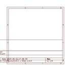
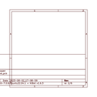
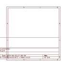
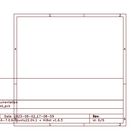

# OOMP Project  
## oomlout_OOMP_V2  by oomlout  
  
oomp key: oomp_projects_flat_oomlout_oomlout_oomp_v2  
(snippet of original readme)  
  
- oomlout-OOMP  
 OOpen Organization Method for Parts  
  
-- Structure  
  
Oomp is now split into 9 repositories:  
  
--- oomlout_OOMP_parts_V2  
https://github.com/oomlout/oomlout_OOMP_parts_V2/  
  
This contains a classification of parts to better describe electronics projects.   
  
---- Each Part  
  
A part is defined by its ID from which it's name can be back generated. (these links are contained in the \src\tag folder and sumarized in [readmeCodes.md](readmeCodes.md)  
  
A part also has a a list of tags that defines it. These tags are defined in the details.py file in the parts folder (\parts). This can be a list of tags or calls to a routine that defines a group of tags based on a category. (ie. HEAD-I01-X-PI03-01 calls OOMPtags.addTags(newPart,"HEAD-I01-X-X-X",pins=pins))  
  
----- ID  
  
A part's ID has five parts  
  
    TYPE-SIZE-COLOR-DESCRIPTION-INDEX  
  
	* TYPE - This defines the part type (Ex. HEAD - Header, LEDS - LED)  
	* SIZE - This is the size category or package of a part (Ex.  I01 - 0.1", W04 - 1.4 Watt Resistor, 0603 - 0603 (SMD))  
	* COLOR - This is the parts color or material (Ex. R - Red, M - Metal ) (Default X)  
	* DESCRIPTION - This is a defining charachteristic of the part and is the same across a type (Ex. (HEAD) PI03 - 3 Pins, (RESE) O561 - 560 Ohms) (Default XXXX)  
	* INDEX - This is an additional piece of information that differentiates a part and can change within type (Ex. 67 - 1% tolerance, RA - right angle) (Default 01)  
  
	More details can be found in [readmeCodes.md](readmeCodes.m  
  full source readme at [readme_src.md](readme_src.md)  
  
source repo at: [https://github.com/oomlout/oomlout_OOMP_V2](https://github.com/oomlout/oomlout_OOMP_V2)  
## Board  
  
  
## Schematic  
  
  
  
[schematic pdf](working_schematic.pdf)  
## Images  
  
  
  
  
  
  
  
  
  
  
  
  
  
  
  
  
