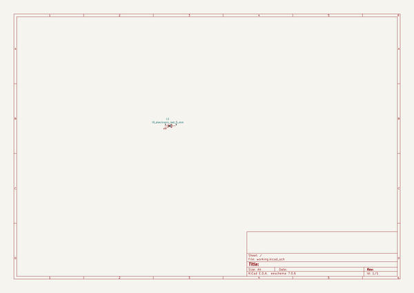

# OOMP Project  
## oomlout_oomp_v3  by oomlout  
  
oomp key: oomp_projects_flat_oomlout_oomlout_oomp_v3  
(snippet of original readme)  
  
- oomlout_oomp_v3  
oopen organization method for parts take three  
  
- parts  
current parts list [parts_readme.md](readme_parts.md)  
  
- files  
  
-- summary  
  
* base/  
  * oomp.py -- the main hold everything together file imports everything needed and holds the dictionary  
  * oomp_create_parts.py -- where the parts are created   
    * oomp_create_parts_led.py -- led part details  
  * oomp_kicad.py -- where all the kicad stuff is sorted,  
   *  oomp_kicad_footprint.py -- footprint matching is done  
  * oomp_working.py -- where things are tested  
* base/kicad  
  * base/kicad/footprints -- location of footprint libraries  
  * base/kicad/symbols -- location of symbols  
* base/src  
  * files  
    * put the item that you want copied to the correct directory filename format (id)_(type)  
      * id can be full name or hash  
      * types can be  
        * _datasheet.pdf  
        * _image.jpg  
  
- name  
  
-- composition  
  
This is composed of up to eight parts. Not all parts are neccesary and are in full text, all special charachters and spaces are replaced with _  
  
1. classification -- the class of item (electronic, mechanical, fastener)  
1. type -- the type of part (led)  
2. size -- the defining size (5_mm, 0603_smd)  
3. color -- a color or defining visual characteristic or material (red, metal, nylon)  
4. description_main -- the main defining parameter (standard, tinted, 60_microfarads, 560_ohms  
5. description_extra -- an extra defining charachteristic (right_angle, surface_mount)  
6. manufacturer -- the name of the   
  full source readme at [readme_src.md](readme_src.md)  
  
source repo at: [https://github.com/oomlout/oomlout_oomp_v3](https://github.com/oomlout/oomlout_oomp_v3)  
## Board  
  
  
## Schematic  
  
  
  
[schematic pdf](working_schematic.pdf)  
## Images  
  
  
  
  
  
  
  
  
  
  
  
  
  
  
  
  
