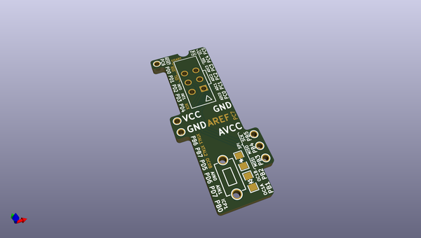
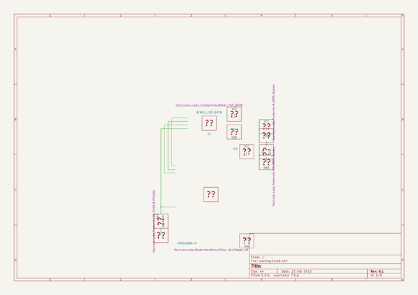

# OOMP Project  
## ISP-Bridge-5  by OssiconeLabs  
  
(snippet of original readme)  
  
- ISP-Bridge-5  
ISP Bridge 5(Atmel ATtiny x8, ATmega x8)    
Source files from KiCad 4.0.2-stable, release build  
  
-----  
http://ossiconelabs.com    
  
Available to Buy at https://www.tindie.com/products/OssiconeLabs/isp-bridge-5atmel-attiny-x8-atmega-x8/    
Assembly Instructions at http://ossiconelabs.com/documentation/ISP_Bridge_5_Instructions_v2.0.pdf    
  
  full source readme at [readme_src.md](readme_src.md)  
  
source repo at: [https://github.com/OssiconeLabs/ISP-Bridge-5](https://github.com/OssiconeLabs/ISP-Bridge-5)  
## Board  
  
  
## Schematic  
  
  
  
[schematic pdf](working_schematic.pdf)  
## Images  
