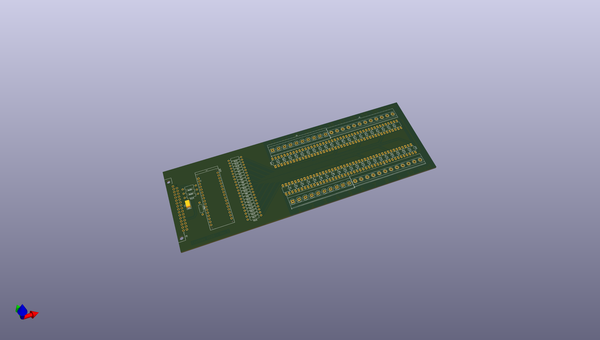
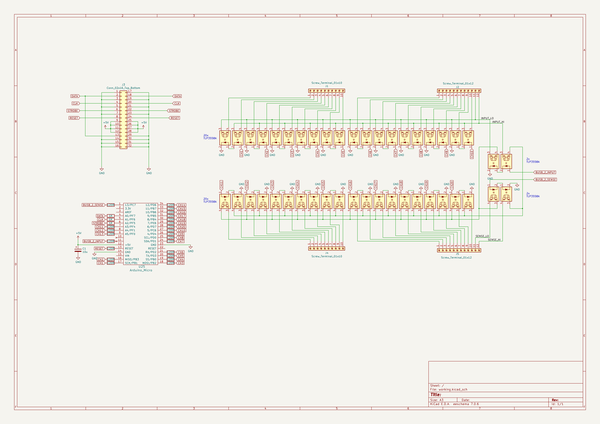

# OOMP Project  
## CozScan2020  by PatrickBaus  
  
(snippet of original readme)  
  
- CozScan2020  
  
  
  
This is a do-it-yourself 20-channel solid-state scanner card compatible with Keithley 2000-SCAN-20 and thus should work with Keithley 2000, 2001, 2002, 2010 and DMM6500 bench multimeters. **Currently this design is tested only on DMM6500.**  
  
|**== Warning ==**|  
|-|  
| **If you decide to build and/or use this card do it at your own risk. I do not guarantee that this design works properly and I can't guarantee that using this won't result any damages to the equipment or won't cause injury. Electrical or thermal limits of this design are unknown/unspecified. So please make sure that you understand the design before attempting to build and/or use it.**|  
  
-- History behind the project  
I've always had a multimeter since highschool, where I studied electronics. But all of them were handheld devices. So recently I decided to get a bench multimeter and Keithley DMM6500 seemed like a perfect choice for my needs. I liked the scanner card support which makes the unit work as a small data acqusition system. I bought a used 2000-SCAN card from eBay and it worked perfectly, I was able to record multiple quantities over long time spans and analyse their dependencies (such as tempco measurement ). But there was one problem: the original SCAN-2000 card has mechanical relays and they are loud therefore logging multiple channels overnight in my office, which is near our bedroom, was an annoying dripping-tap simulator. So I decided to build mysel  
  full source readme at [readme_src.md](readme_src.md)  
  
source repo at: [https://github.com/PatrickBaus/CozScan2020](https://github.com/PatrickBaus/CozScan2020)  
## Board  
  
  
## Schematic  
  
  
  
[schematic pdf](working_schematic.pdf)  
## Images  
