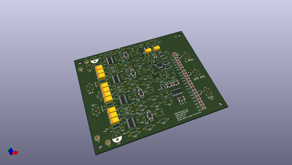
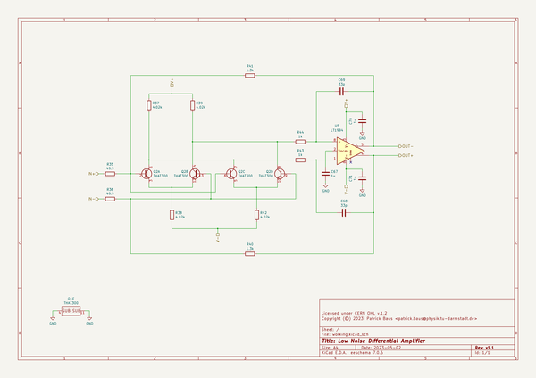

# OOMP Project  
## differential_lna  by PatrickBaus  
  
oomp key: oomp_projects_flat_patrickbaus_differential_lna  
(snippet of original readme)  
  
Low Noise Differential Amplifier  
===================  
  
This repository contains the schematics and mechanical files for a low noise diffrential amplifier based on the Linear Technologies [AN-159](https://www.analog.com/media/en/technical-documentation/app-notes/an-159.pdf).  
  
Key Features:  
 * Bandwidth (-3 dB): 10 Hz - 1.5 MHz  
 * Gain: 80 dB (10.000)  
 * Noise floor $500\text{ pV}/\sqrt{\text{Hz}}$  
 * Note: Requires a very low source impedance! Less than 10 Ohm.  
  
The design was done using [KiCAD 7](https://www.kicad.org/).  
  
Mechanical Design  
------------------------------  
The PCB should be housed in a mild steel box (e.g. cookie jar).  
  
About  
-----  
  
The root folder contains the KiCAD files, while the gerber files can be found in the [/gerber](gerber/) folder, the bill of materials in the [/bom](bom/) folder.  
  
Related Repositories  
--------------------  
  
See the following repositories for more information  
  
KiCAD footprints: https://github.com/PatrickBaus/footprints.pretty  
  
KiCAD 3D models: https://github.com/PatrickBaus/footprints.3dshapes  
  
KiCAD schematic libraries: https://github.com/PatrickBaus/KiCad-libraries  
  
License  
-------  
  
This work is released under the Cern OHL v.1.2  
See www.ohwr.org/licenses/cern-ohl/v1.2 or the included LICENSE file for more information.  
  
  full source readme at [readme_src.md](readme_src.md)  
  
source repo at: [https://github.com/PatrickBaus/differential_lna](https://github.com/PatrickBaus/differential_lna)  
## Board  
  
  
## Schematic  
  
  
  
[schematic pdf](working_schematic.pdf)  
## Images  
