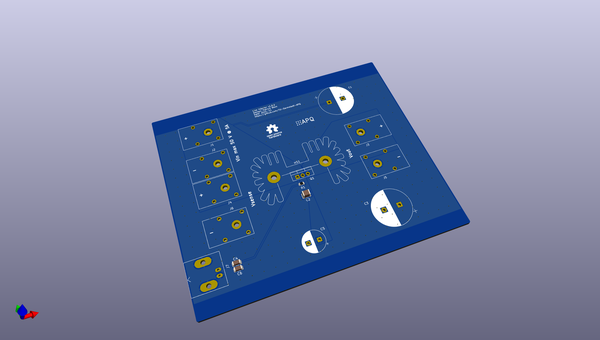
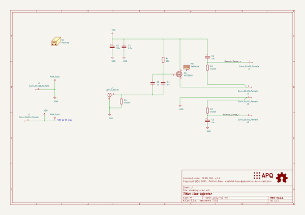
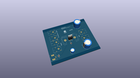
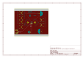
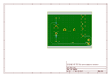
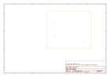
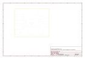
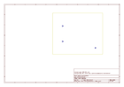
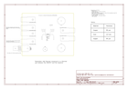

# OOMP Project  
## line_injector  by PatrickBaus  
  
oomp key: oomp_projects_flat_patrickbaus_line_injector  
(snippet of original readme)  
  
Line Injector  
===================  
  
This repository contains the schematics and mechanical files for a line injector. A line can be used to inject a ripple voltage into the supply line of a circuit. This can, for example, be used to measure the [power supply rejection ratio (PSRR)](https://en.wikipedia.org/wiki/Power_supply_rejection_ratio) of a regulator.  
  
Key Features:  
 * Bandwidth (-3 dB): 6 Hz - 35 MHz (into 50 Ω)  
 * Passband transfer function is about 0.95 V/V (@ 5V) and 0.975 V/V (@ 15V)  
 * Maximum input voltage: 50 V  
 * Maximum current: 5 A  
 * Remote sensing inputs to compensate for the voltage drop over the MOSFET  
  
  
  
The design was done using [KiCAD 6](https://www.kicad.org/).  
  
Bode Plot  
------------------------------  
  
  
Additionally, a report from the Bode 100 VNA used to characterize the injector can be found [here](/supplemental/Line%20Injector_JFW.pdf).  
  
Photos of the finished design  
------------------------------  
  
--- Front  
  
  
  
--- Back  
  
  
  
--- PCB  
  
  
  
About  
-----  
  
The root folder contains the KiCAD files, while the gerber files can be found in the [/gerber](gerber/) folder, the bill of materials in the [/bom](bom/) folder.  
  
Related Repositories  
--------------------  
  
See the following repositories for more information  
  
KiCAD footp  
  full source readme at [readme_src.md](readme_src.md)  
  
source repo at: [https://github.com/PatrickBaus/line_injector](https://github.com/PatrickBaus/line_injector)  
## Board  
  
  
## Schematic  
  
  
  
[schematic pdf](working_schematic.pdf)  
## Images  
  
  
  
  
  
  
  
  
  
  
  
  
  
  
  
  
