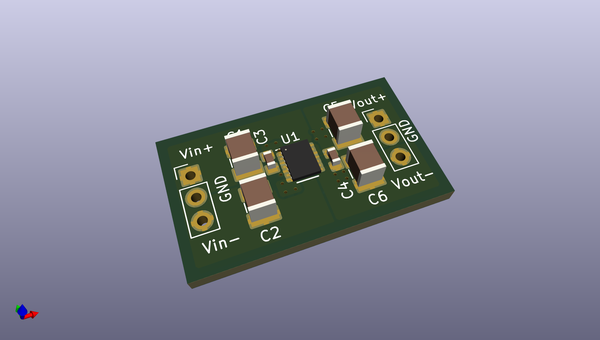
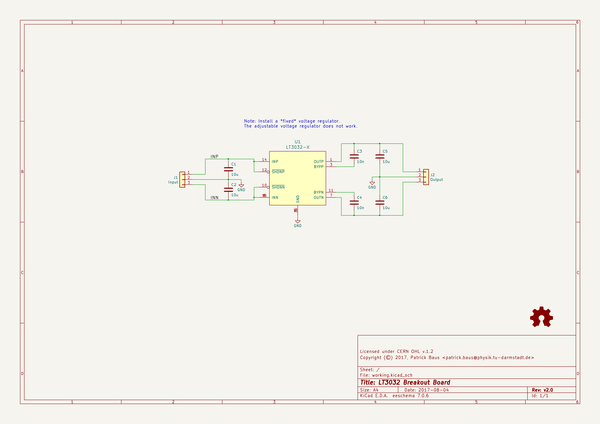

# OOMP Project  
## LT3032_breakout  by PatrickBaus  
  
oomp key: oomp_projects_flat_patrickbaus_lt3032_breakout  
(snippet of original readme)  
  
LT3032  
===================  
  
This repository contains the KiCAD PCB project files for a breakout board for the Linear Technologies LT3032 dual 150 mA,  
positive/negative, low noise, LDO (http://www.linear.com/product/LT3032).  
  
  
  
About  
-----  
This breakout board only supports the fixed voltage versions of the LT3032. There are 4 version available:  
 * ±3.3V  
 * ±5V  
 * ±12V  
 * ±15V  
  
The root folder contains the KiCAD files and the bill of materials, while the gerber files can be found in the [/gerber](gerber/) folder.  
  
Related Repositories  
-------------  
  
See the following repositories for more information  
  
KiCAD footprints: https://github.com/PatrickBaus/footprints.pretty  
  
KiCAD 3D models: https://github.com/PatrickBaus/footprints.3dshapes  
  
KiCAD schematic libraries: https://github.com/PatrickBaus/KiCad-libraries  
  
License  
-------  
  
This work is released under the Cern OHL v.1.2  
See www.ohwr.org/licenses/cern-ohl/v1.2 or the included LICENSE file for more information.  
  
  full source readme at [readme_src.md](readme_src.md)  
  
source repo at: [https://github.com/PatrickBaus/LT3032_breakout](https://github.com/PatrickBaus/LT3032_breakout)  
## Board  
  
  
## Schematic  
  
  
  
[schematic pdf](working_schematic.pdf)  
## Images  
