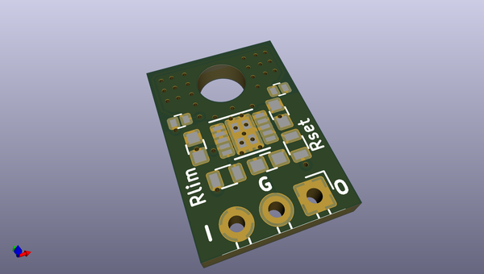
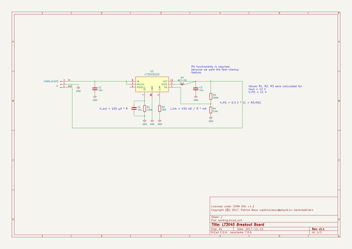

# OOMP Project  
## LT3045_breakout  by PatrickBaus  
  
(snippet of original readme)  
  
LT3042/LT3045 Breakout Board  
===================  
  
This repository contains the KiCAD PCB project files for a breakout board for the Linear Technologies LT3042/LT3045  ultralow noise, ultrahigh PSRR, 200/500 mA LDO regulator (http://www.linear.com/product/LT3042, http://www.linear.com/product/LT3045).  
  
  
  
About  
-----  
This breakout board supports both the LT3042 and LT3045 LDO regulator. The package is designed as a drop-in replacement for the popular 78xx series.  
  
The root folder contains the KiCAD files and the bill of materials, while the gerber files can be found in the [/gerber](gerber/) folder.  
  
Thermal considerations  
-----  
The breakout board was tested with an LT3045 with different heat sink configurations to give an estimate on the expected temperature rise. This should help with the decision whether to add a heat sink or not. The test was done using a 35 µm (1 oz./ft²) copper board. The LT3045 was configured for an 11 V output from a 13 V input running at ~500 mA.  
  
Using a thermal imaging camera the temperature was measured and the thermal resistance was calculated using the known ambient temperature (~23 °C).  
  
----- No Heat Sink  
  
  
----- Using a 25 K/W Heat Sink  
  
  
  
Dropping 2 V @ 500 mA, a Fischer Elekronik [FK 220 SA 220](http://www.fischerelektronik.de/web_fische  
  full source readme at [readme_src.md](readme_src.md)  
  
source repo at: [https://github.com/PatrickBaus/LT3045_breakout](https://github.com/PatrickBaus/LT3045_breakout)  
## Board  
  
  
## Schematic  
  
  
  
[schematic pdf](working_schematic.pdf)  
## Images  
