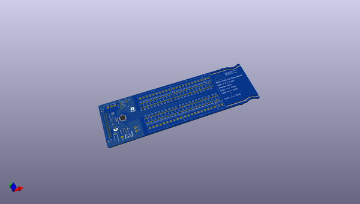
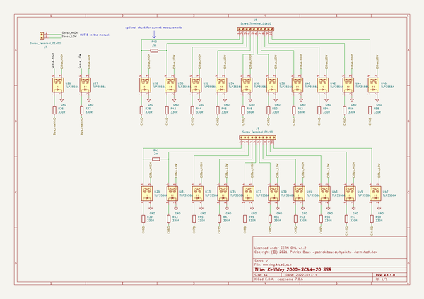
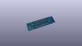
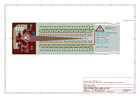
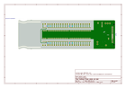
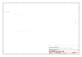
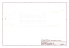
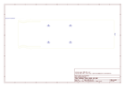
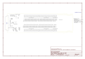

# OOMP Project  
## SCAN2000  by PatrickBaus  
  
oomp key: oomp_projects_flat_patrickbaus_scan2000  
(snippet of original readme)  
  
Keithley SCAN2000 SSR Replacement  
===================  
  
This repository contains the KiCAD PCB project files for a Keithley SCAN2000 replacement card. It uses solid-state relays instead of mechanical relays.  
  
  
  
|DMM|Tested|Works|Note|  
|--|--|--|--|  
|[DMM6500](https://www.tek.com/en/products/keithley/digital-multimeter/dmm6500)|:heavy_check_mark:|:heavy_check_mark:||  
|2000|:x:|:heavy_check_mark:|Not tested, but should work. The latest firmware seems to [support 20 channels](https://www.eevblog.com/forum/circuit-studio/example-project-20-channel-solid-state-scan-card-for-k2000-dmm/msg3101128/-msg3101128).|  
|2000-20|:x:|:heavy_check_mark:|Not tested, but should work.|  
|[2010](https://www.tek.com/en/products/keithley/digital-multimeter/2010-series)|:x:|:x:|Not tested, but should be the same as the Model 2002.|  
|[2001](https://www.tek.com/en/products/keithley/digital-multimeter/2001-series)|:x:|:x:|Not tested, but should be the same as the Model 2002.|  
|[2002](https://www.tek.com/en/products/keithley/digital-multimeter/2002-series)|:heavy_check_mark:|:x:|The serial clock of 2 MHz is too fast for the MCU.|  
  
About  
-----  
The root folder contains the KiCAD files. The bill of materials can be found in the [/bom](bom/) folder, while the gerber files can be found in the [/gerber](gerber/) folder.  
  
Description  
-------------------  
The design is based on the SCAN2000 pcb made by [George Christidis](https://github.com/macgeorge/SCAN2000STM32). It also  
  full source readme at [readme_src.md](readme_src.md)  
  
source repo at: [https://github.com/PatrickBaus/SCAN2000](https://github.com/PatrickBaus/SCAN2000)  
## Board  
  
  
## Schematic  
  
  
  
[schematic pdf](working_schematic.pdf)  
## Images  
  
  
  
  
  
  
  
  
  
  
  
  
  
  
  
  
