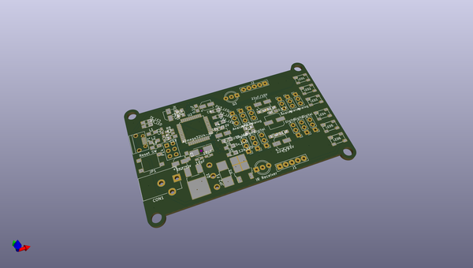

# OOMP Project  
## Zoumo-Bot-Rio  by PCSmithy  
  
(snippet of original readme)  
  
- Zoumo-Bot-Rio  
An Atmega32u4 and a set up motor drivers heavily modeled off the Sparkfun Arduino Pro Micro and the Adafruit Motor Driver Shield v2  
  
https://www.sparkfun.com/products/12640  
  
https://www.adafruit.com/product/1438  
  
  
  
  full source readme at [readme_src.md](readme_src.md)  
  
source repo at: [https://github.com/PCSmithy/Zoumo-Bot-Rio](https://github.com/PCSmithy/Zoumo-Bot-Rio)  
## Board  
  
  
## Schematic  
  
  
  
[schematic pdf](working_schematic.pdf)  
## Images  
