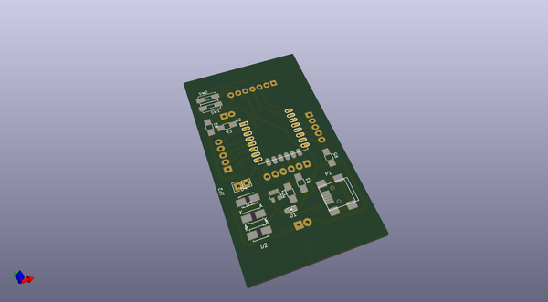
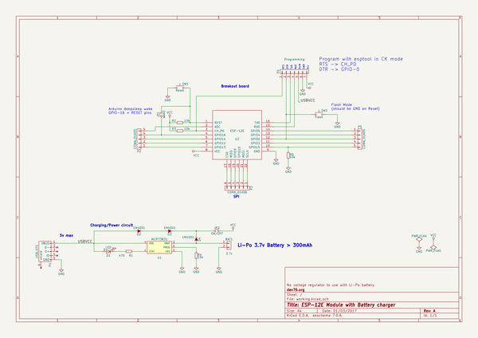

# OOMP Project  
## esp12-board  by peekpt  
  
(snippet of original readme)  
  
- esp12-board  
A ESP-12E breakout board that has a battery charger and can run on deepsleep without wasting current with a DC-DC regulators.  
  
  full source readme at [readme_src.md](readme_src.md)  
  
source repo at: [https://github.com/peekpt/esp12-board](https://github.com/peekpt/esp12-board)  
## Board  
  
  
## Schematic  
  
  
  
[schematic pdf](working_schematic.pdf)  
## Images  
