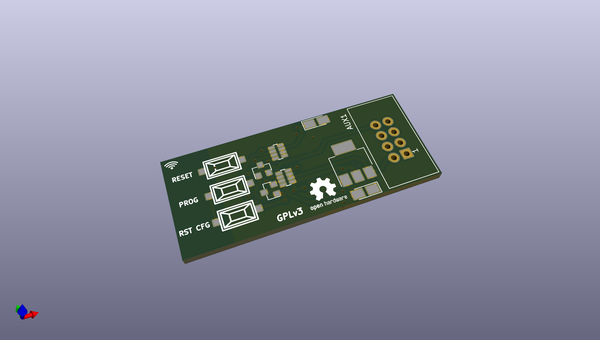

# OOMP Project  
## ESP3D-shield  by peekpt  
  
oomp key: oomp_projects_flat_peekpt_esp3d_shield  
(snippet of original readme)  
  
-- ESP3D-SHIELD  
ESP3D - it's a software based on ESP8266 module to give Wi-Fi capabilities 3D Printers.  
  
ESP3D-SHIELD - it's an adapter to connect a 3D printer AUX-1 port  
  
--  
  
*ESP3D info:*  
  
* [ESP3D](https://github.com/luc-github/ESP3D)  
  
* [ESP3D WEBUI](https://github.com/luc-github/ESP3D-WEBUI)  
  
  
--  
  
  
  
  
  
  
*WIP*  
  
  
  
  full source readme at [readme_src.md](readme_src.md)  
  
source repo at: [https://github.com/peekpt/ESP3D-shield](https://github.com/peekpt/ESP3D-shield)  
## Board  
  
  
## Schematic  
  
  
  
[schematic pdf](working_schematic.pdf)  
## Images  
