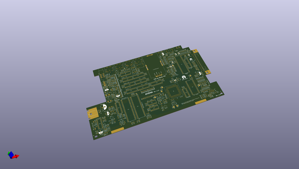
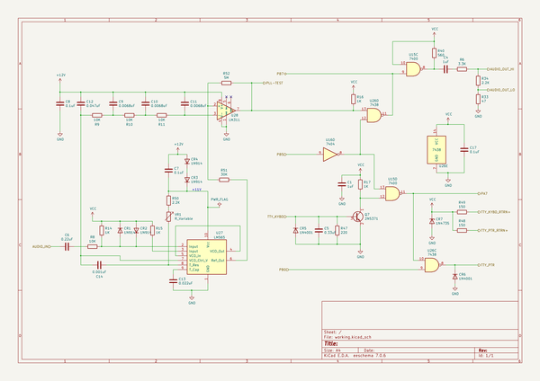

# OOMP Project  
## bit-preserve  by pelrun  
  
(snippet of original readme)  
  
- Bit Preserve  
Recreating classic computer schematics. Let's convert all those random scanned PDFs into a modern, editiable and re-usable format.  
  
Most of the directories are empty. They represent the structure I had initially had in mind. I'm working on the Apple IIgs ROM3 schematic. Another contributor has provided schematics for the Altair 8800. There is plenty of room for you to contribute!  
  
- How it works  
Pick a system, find a schematic, and start drawing. The project has picked [KiCad](http://kicad.org) as the primary schematic capture tool. If there are variants of the schematic, give them their own directory. If you see a system you'd like to contribute but it isn't listed, just [submit a pull request](https://github.com/baldengineer/bit-preserve/pulls). If you start working on a system, do a pull on the readme file in that directory and put your name there as "working on it."   
  
Have suggestions on how to manage that workflow? Then [submit an issue](https://github.com/baldengineer/bit-preserve/issues)!  
  
- More information  
I first announced this project at KiCon 2019. Here are some links to get background about the project.  
* Watch my original talk: https://www.youtube.com/watch?v=fBaU4JZOVzk  
* Download my slides: https://baldengineer.com/kicon2019  
* See additional info on baldengineer.com: https://www.baldengineer.com/bit-preserve-vintage-schematics-with-kicad.html  
  
- Rules  
My goal is to have minimal rules. Right now I'd like us all to focus on documenting these syste  
  full source readme at [readme_src.md](readme_src.md)  
  
source repo at: [https://github.com/pelrun/bit-preserve](https://github.com/pelrun/bit-preserve)  
## Board  
  
  
## Schematic  
  
  
  
[schematic pdf](working_schematic.pdf)  
## Images  
