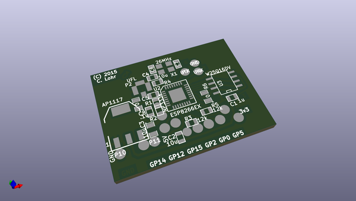
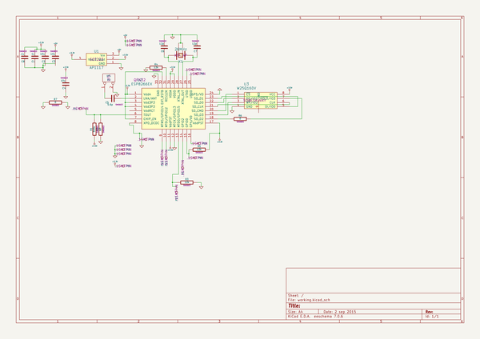

# OOMP Project  
## colorchord  by pelrun  
  
(snippet of original readme)  
  
ColorChord  
==========  
  
What is ColorChord?  
-------------------  
  
Chromatic Sound to Light Conversion System.  It's really that simple.  Unlike so many of the sound responsive systems out there, ColorChord looks at the chromatic properties of the sound.  It looks for notes, not ranges.  If it hears an "E" it doesn't care what octave it's in, it's an E.  This provides a good deal more interesting patterns between instruments and music than would be available otherwise.  
  
Background Video here:  
  
  
  
ColorChord on an ESP8266:  
  
  
  
More videos below!  
  
Background  
----------  
  
Developed over many years, ColorChord 2 is now at the alpha stages.  ColorChord 2 uses the same principles as ColorChord 1.  A brief writeup on that can be seen here: http://cnlohr.blogspot.com/2010/11/colorchord-sound-lighting.html  
  
The major differences in ColorChord 2 is the major rewrite to move everything back to the CPU and a multitude of algorithmic optimizations to make it possible to run on something other than the brand newest of systems.  
  
Feuge in D Minor (ColorChord 2 running a strip of WS2812 LEDs):  
  
  
  
ColorChord 2 running a voronoi diagram with Mayhem's Dr.  
  full source readme at [readme_src.md](readme_src.md)  
  
source repo at: [https://github.com/pelrun/colorchord](https://github.com/pelrun/colorchord)  
## Board  
  
  
## Schematic  
  
  
  
[schematic pdf](working_schematic.pdf)  
## Images  
