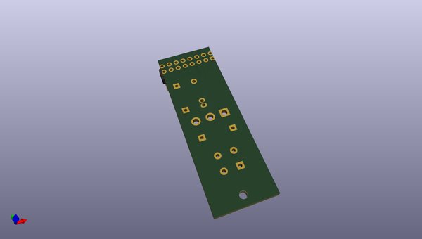
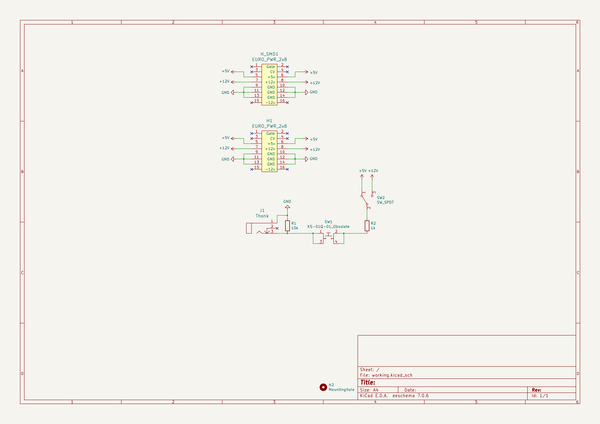

# OOMP Project  
## btn-gate-modular  by quinkennedy  
  
(snippet of original readme)  
  
Basic module for testing gate inputs on other modules.  
  
Press the button, output goes high. The toggle allows you to select 'high' between 5v and 12v bus power.  
  
  full source readme at [readme_src.md](readme_src.md)  
  
source repo at: [https://github.com/quinkennedy/btn-gate-modular](https://github.com/quinkennedy/btn-gate-modular)  
## Board  
  
  
## Schematic  
  
  
  
[schematic pdf](working_schematic.pdf)  
## Images  
