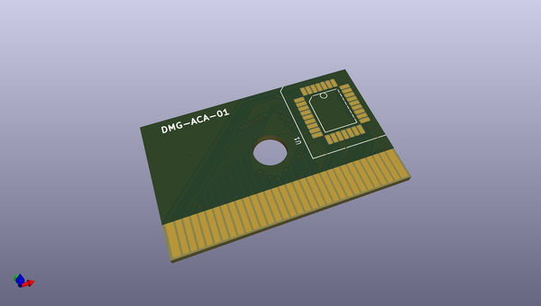
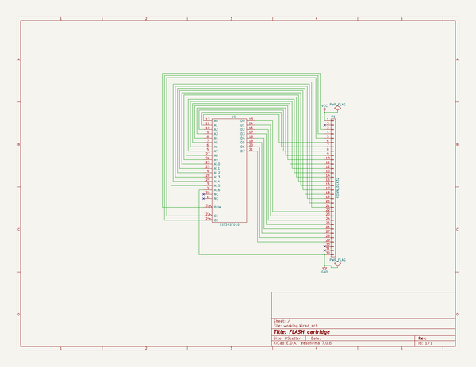

# OOMP Project  
## cartridge-boards  by quinkennedy  
  
oomp key: oomp_projects_flat_quinkennedy_cartridge_boards  
(snippet of original readme)  
  
This repository is designed to hold various schematics,   
PCB layouts, and associated files for game system cartridges  
  
* [gameboy-mbc0](gameboy-mbc0/)  
  - A gameboy cartridge with no Memory Bank Controller. Can hold a ROM up to 32KByte.  
  
  full source readme at [readme_src.md](readme_src.md)  
  
source repo at: [https://github.com/quinkennedy/cartridge-boards](https://github.com/quinkennedy/cartridge-boards)  
## Board  
  
  
## Schematic  
  
  
  
[schematic pdf](working_schematic.pdf)  
## Images  
