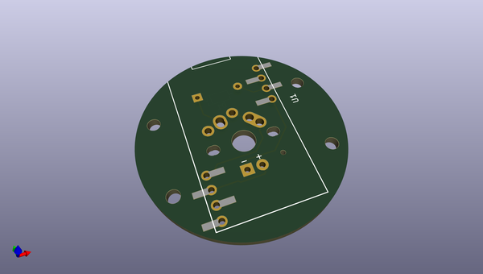
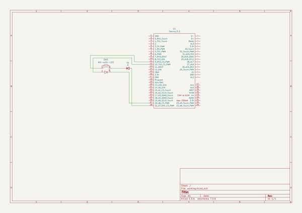

# OOMP Project  
## TeensyKey  by quinkennedy  
  
oomp key: oomp_projects_flat_quinkennedy_teensykey  
(snippet of original readme)  
  
One teensy, one key  
  
-- Submodules  
  
This project uses submodules, make sure to check them out!  
  
Either `git clone --recursive-submodules https://github.com/quinkennedy/TeensyKey.git`  
  
Or, if you have already checked out the repo... `git submodule init` and `git submodule update`  
  
-- Intro  
  
A small project to attach one keyboard switch to a teensy.  
This will be primarily done as a single-sided board for milling  
on a hobbyist CNC.  
  
  full source readme at [readme_src.md](readme_src.md)  
  
source repo at: [https://github.com/quinkennedy/TeensyKey](https://github.com/quinkennedy/TeensyKey)  
## Board  
  
  
## Schematic  
  
  
  
[schematic pdf](working_schematic.pdf)  
## Images  
