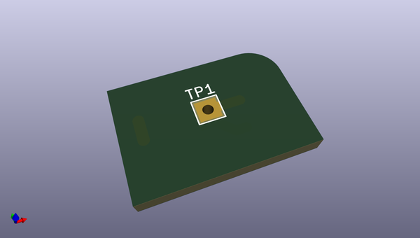

# OOMP Project  
## kiplot  by rdeterre  
  
(snippet of original readme)  
  
- KiPlot  
  
KiPlot is a program which helps you to plot your KiCad PCBs to output  
formats easily, repeatable, and most of all, scriptably. This means you  
can use a Makefile to export your KiCad PCBs just as needed.  
  
For example, it's common that you might want for each board rev:  
  
* Check DRC one last time (currently not possible)  
* Gerbers, drills and drill maps for a fab in their favourite format  
* Fab docs for the assembler  
* Pick and place files  
  
You want to do this in a one-touch way, and make sure everything you need to  
do so it securely saved in version control, not on the back of an old  
datasheet.  
  
KiPlot lets you do this.  
  
As a side effect of providing a scriptable plot driver for KiCad, KiPlot also  
allows functional testing of KiCad plot functions, which would otherwise be  
somewhat unwieldy to write.  
  
-- Using KiPlot  
  
You can call `kiplot` directly, passing a PCB file and a config file:  
  
```  
-b $(PCB) -c $(KIPLOT_CFG) -v  
```  
  
A simple target can be added to your `makefile`, so you can just run  
`make pcb_files` or integrate into your current build process.  
  
```  
pcb_files:  
    kiplot -b $(PCB) -c $(KIPLOT_CFG) -v  
```  
  
-- Installing  
  
--- Set up a virtualenv (if you installed KiCad normally)  
  
If you installed KiCad from a package manager, or you used `make install`,  
you probably have the packages and libraries on you system paths.  
  
```  
virtualenv --python /usr/bin/python2.7 --system-site-packages ~/venv/kiplot  
```  
  
--- Set up a virtualenv (if you installed KiCad locally)  
  
  full source readme at [readme_src.md](readme_src.md)  
  
source repo at: [https://github.com/rdeterre/kiplot](https://github.com/rdeterre/kiplot)  
## Board  
  
[](working_3d.png)  
## Schematic  
  
[](working_schematic.png)  
  
[schematic pdf](working_schematic.pdf)  
## Images  
