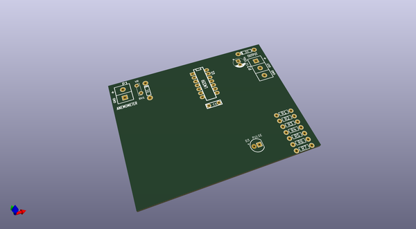
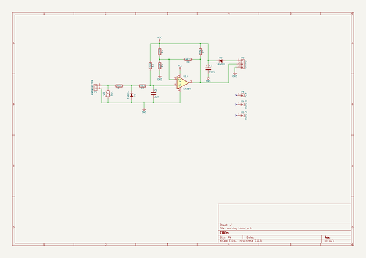

# OOMP Project  
## AnemometerConverter  by re-innovation  
  
(snippet of original readme)  
  
- AnemometerConverter  
A simple unit to convert an AC anemometer output to a digital pulse train.  
  
-- Why is it needed?  
  
-- What are the specifications?  
  
1) from a voltage supply of 15 V down to 3.3 V (and it can go even lower);  
2) from 200 Hz down to 0.01 Hz (10 mHz) (higher than the highest recording of 125 Hz); and  
3) down to 60 mVpp (lower than the required 80 mVpp).  
  
-- What equipment is required?  
  
-- PCB design  
  
  
-- Future Issues  
  
  
  full source readme at [readme_src.md](readme_src.md)  
  
source repo at: [https://github.com/re-innovation/AnemometerConverter](https://github.com/re-innovation/AnemometerConverter)  
## Board  
  
  
## Schematic  
  
  
  
[schematic pdf](working_schematic.pdf)  
## Images  
