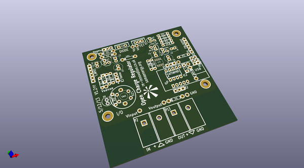

# OOMP Project  
## ColourVolt  by re-innovation  
  
oomp key: oomp_projects_flat_re_innovation_colourvolt  
(snippet of original readme)  
  
ColourVolt  
==========  
  
This is the github repository for the ColourVolt  
  
The PCB was re-designed by by Matt Little from Renewable Energy Innovation.  
  
  
Contact:  
www.re-innovation.co.uk  
matt@re-innovation.co.uk  
  
Overview:  
  
This unit measures voltage and displays it as a colour on an RGB LED.  
It also reads out the voltage on the serial port when asked via its unique ID.  
It can be calibrated (via a serial command) and can have its ID changed (via serial command)  
  
see www.re-innovation.co.uk for more details  
  
  
Files in the repository:  
	  
	Readme  
	PCB files for KiCAD  
	PCB gerber files  
  
  
Modified:  
  
  
  
To Do:  
  
  
  full source readme at [readme_src.md](readme_src.md)  
  
source repo at: [https://github.com/re-innovation/ColourVolt](https://github.com/re-innovation/ColourVolt)  
## Board  
  
  
## Schematic  
  
  
  
[schematic pdf](working_schematic.pdf)  
## Images  
