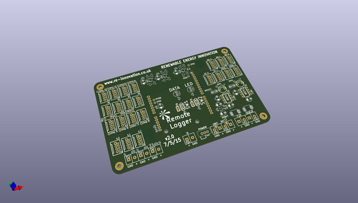

# OOMP Project  
## DataLogger  by re-innovation  
  
(snippet of original readme)  
  
- DataLogger  
A remote datalogging system with many connectivity options.  
  
Based upon the LinkIt One system on a chip board:  
  
https://www.seeedstudio.com/LinkIt-ONE-p-2017.html  
  
-- Hardware  
  
PCB has been designed in KiCAD and the files are available in this repository.  
  
PCB has 2 x DC DC converters and a LiIon charger for recharging the battery.  
  
3 x ACS1115 16 bit ADCs are used for monitoring the data.  
  
  
-- Software  
  
The software has been written in C for upload via the Arduino IDE.  
  
A configuration file is used on the SD card which lets the unit know how it needs to work. Set up can easily be done 'in the field'.  
  
  
  full source readme at [readme_src.md](readme_src.md)  
  
source repo at: [https://github.com/re-innovation/DataLogger](https://github.com/re-innovation/DataLogger)  
## Board  
  
  
## Schematic  
  
  
  
[schematic pdf](working_schematic.pdf)  
## Images  
