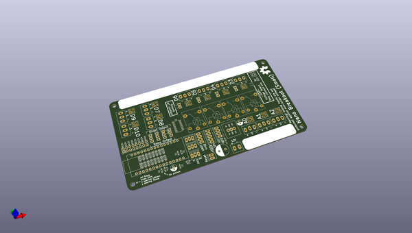
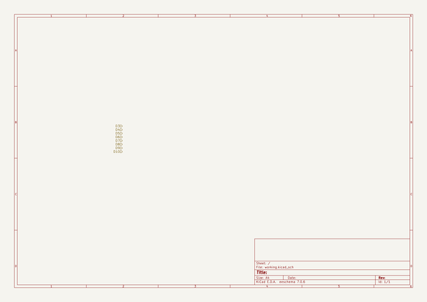

# OOMP Project  
## Frequency_Control_Crank  by re-innovation  
  
(snippet of original readme)  
  
- Frequency_Control_Crank  
  
A crank handled swicth that controls power to things when turned.  
This was built for an update to the Kinetiscopes from Ben Wigley.  
Some ifnormation and video is available here:  
  
https://www.re-innovation.co.uk/portfolio/kinetiscopes-a-lost-paradise/  
  
This repository has the arduino nano control code, the design files for the magnetic sensor and datasheets for the control board used.  
It also includes some photos.  
  
To Do:  
  
* Upload photos  
* Do dimensioned design for future use  
  
  
  full source readme at [readme_src.md](readme_src.md)  
  
source repo at: [https://github.com/re-innovation/Frequency_Control_Crank](https://github.com/re-innovation/Frequency_Control_Crank)  
## Board  
  
  
## Schematic  
  
  
  
[schematic pdf](working_schematic.pdf)  
## Images  
