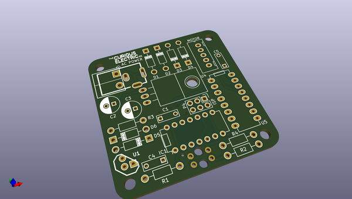
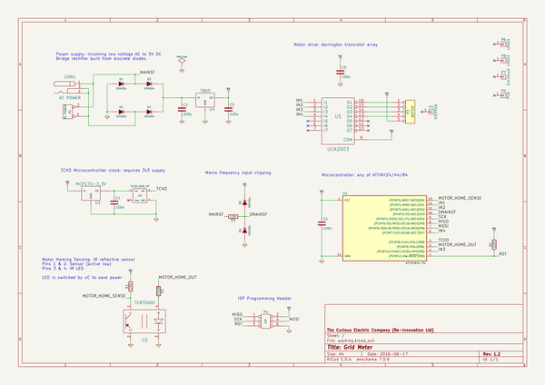

# OOMP Project  
## gridMeter  by re-innovation  
  
(snippet of original readme)  
  
- gridMeter  
A National Grid frequency monitor for visualising power flows on the national grid  
  
- Overview  
  
  
  
  
- Collaborators  
* James Fowkes - Software and PCB design v1  
* Matt Little - PCB design v2 and Hardware  
  
  
- PCB  
This holds the PCB files done using KiCAD  
http://kicad-pcb.org/  
  
- Software  
This holds the software. Uploaded via the Arduino IDE.  
This is programmed to an ATTiny84  
It requires  
  
- Hardware  
This holds the mechanical files for the enclosure.  
  
  
  
- To DO  
  
- Update PCB design with changes  
- Enclosure design - version 1 done  
  
  full source readme at [readme_src.md](readme_src.md)  
  
source repo at: [https://github.com/re-innovation/gridMeter](https://github.com/re-innovation/gridMeter)  
## Board  
  
  
## Schematic  
  
  
  
[schematic pdf](working_schematic.pdf)  
## Images  
