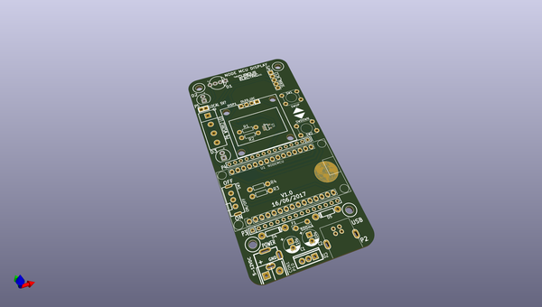

# OOMP Project  
## MiniPredictionMachine  by re-innovation  
  
oomp key: oomp_projects_flat_re_innovation_minipredictionmachine  
(snippet of original readme)  
  
- MiniPredictionMachine  
Arduino based weather sensor unit with solar PV charing and an ESP8266 based receiver unit.  
  
This repository holds the KiCAD PCB design files and the various .dxf files for the hardware.  
  
This repository is for information only and is not maintained.  
  
Please see: https://www.re-innovation.co.uk/ for more information.  
  
  
  full source readme at [readme_src.md](readme_src.md)  
  
source repo at: [https://github.com/re-innovation/MiniPredictionMachine](https://github.com/re-innovation/MiniPredictionMachine)  
## Board  
  
  
## Schematic  
  
  
  
[schematic pdf](working_schematic.pdf)  
## Images  
