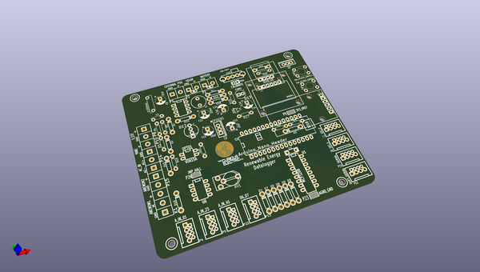

# OOMP Project  
## relogger  by re-innovation  
  
(snippet of original readme)  
  
- Renewable Energy Data Logger  
A multi-function renewable energy data-logger for remote logging.  
This is an Arduino-based data-logger desinged to have reasanable accuracy, be low-cost, suitable for use in remote areas and to be user-friendly to set-up and use.  
  
This is based upon work with Wind Empowerment.  
  
This repository contains:  
* An overview of the project and functions  
* The Schematics and PCB design files (KiCAD)  
* The Arduino control code and associated libraries  
* Datasheets for all the components  
* Instructions for use  
  
  
- Sensors and Data  
This logger can use different types of sensor attached to the inputs.  
  
The set-up is defined on the config.txt file which must be included on the SD card.  
  
The data required on the config.txt file is:  
  
* Sample Time  
* Sensor 1  
* Sensor 2  
  
Example config.txt file:  
  
TO DO!  
  
The types of sensor available are:  
  
-- Wind Speed Digital  
  
These are conencted to a digital pin on the device.  
  
Conversion factor required is the pulses per second to give 1m/s wind speed.   
  
eg: 0.6 pulse per second = 1m/s  
  
If we read 15 pulses per second the wind speed is: 15/0.6 = 25m/s.  
  
-- Wind Speed Analog  
  
This is connected to an analog pin.  
  
The conversion factor is the voltage to wind speed factor.  
  
eg. 0.1V per m/s  
  
If we read a voltage of 0.6V then the wind speed is 0.6 / 0.1 = 6m/s  
  
-- Wind Direction  
  
Wind direction uses a wind vane sensor with reed switches are used to introduce different resistors to the output line. Hence the output is a varying re  
  full source readme at [readme_src.md](readme_src.md)  
  
source repo at: [https://github.com/re-innovation/relogger](https://github.com/re-innovation/relogger)  
## Board  
  
  
## Schematic  
  
  
  
[schematic pdf](working_schematic.pdf)  
## Images  
