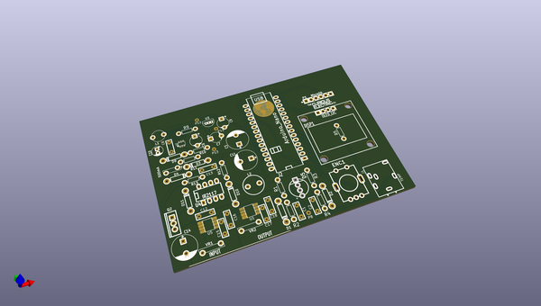

# OOMP Project  
## RenewableRegulator  by re-innovation  
  
oomp key: oomp_projects_flat_re_innovation_renewableregulator  
(snippet of original readme)  
  
- Renewable Regulator  
  
- Overview  
  
This is an open-source project to design a simple, low-cost, Charge Regulator Designs for off-grid renewable energy projects.  
  
A charge-controller protects a re-chargeable battery from over (and sometime under) charging from a renewable energy resource.  
  
This controller will work as a Series and Shunt controller. Future improvements include working as a Maximum Power Point Tracking.  
The design is based upon the Arduino IDE and will use one version of the Arduino processors (Arduino Nano initially).  
Voltage is measured using a potential divider.  
Current is measured using a hall-effect current sensor.  
Temperature is measured using a 1-wire digital temperature probe.  
  
A small OLED or LCD screen is used to show the data.  
A rotary encoder is used for input data.  
Data will also be sent via a serial connection for data-logging use.  
  
  
-- Specifications:  
  
Maximum working voltage: 60V DC  
Maximum working current: 50A DC  
Measurement accuracy voltage:  
Measurement accuracy current:  
Temperature: -20 to 150C 0.1C steps  
  
  
  
-- Contributors  
  
Overview and project concept by Matthew Little (matt@re-innovation.co.uk)  
Phase 1 by Arnaud Moulas (arnaud.moulas@gmail.com)  
Phase 2 by Yoan Gornes (yoan.gornes@gmail.com)  
  
This project has been part of a larger project for modular power electronics concept initiated by Wind Empowerment:  
http://www.wisions.net/projects/exchange-modular-power-to-the-people-democratising-energy-access-through-mo-project121  
  
This section of t  
  full source readme at [readme_src.md](readme_src.md)  
  
source repo at: [https://github.com/re-innovation/RenewableRegulator](https://github.com/re-innovation/RenewableRegulator)  
## Board  
  
  
## Schematic  
  
  
  
[schematic pdf](working_schematic.pdf)  
## Images  
