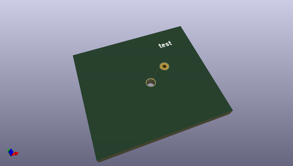

# OOMP Project  
## fcad_pcb  by realthunder  
  
(snippet of original readme)  
  
-- FreeCAD scripts for PCB CAD/CAM & FEM  
  
fcad_pcb is yet another way to improve ECAD/MCAD collaboration between  
[FreeCAD](https://www.freecad.org/) and [KiCAD](https://kicad.org/).  
  
The original purpose of these tools was to do **PCB milling in FreeCAD**. It can do much more now.:  
* It can **generate gcode from kicad_pcb** directly without going through the gerber stage.  
* It can let your **modify the PCB directly inside FC** (done already),  
* and potentially export back to kicad_pcb (partially done).  
* and finally it can **generate solid tracks, pads and plated drills to enable FEM and thermal analysis** on KiCad pcb boards.  
  
-- Installation  
  
The fcad_pcb macro is written in Python and requires **FreeCAD 0.17** or later to work properly.  
  
1. Clone this repo into your freecad macro directory. To check what the default path of your macro directory is go to dropdown `Macro` > `Macros..` and find the path in the field User macros location  
    ```bash  
    cd <path/to/your/macros/directory>  
    git clone https://github.com/realthunder/fcad_pcb/  
    ```  
2. Enter the locally cloned repository  
    ```bash  
    cd fcad_pcb/  
    ```   
3. Download the repository submodules  
    ```python  
    git submodule update --init --recursive  
    ```  
4. Restart FreeCAD  
  
-- Usage  
  
At this time fcad is usable through the [FreeCAD python console](https://wiki.freecad.org/Python_console).   
  
* Start FreeCAD,  
* Launch the python console  
  Enable through the `View > Panels > Python Console` dropdown menu  
*   
  full source readme at [readme_src.md](readme_src.md)  
  
source repo at: [https://github.com/realthunder/fcad_pcb](https://github.com/realthunder/fcad_pcb)  
## Board  
  
[](working_3d.png)  
## Schematic  
  
[](working_schematic.png)  
  
[schematic pdf](working_schematic.pdf)  
## Images  
