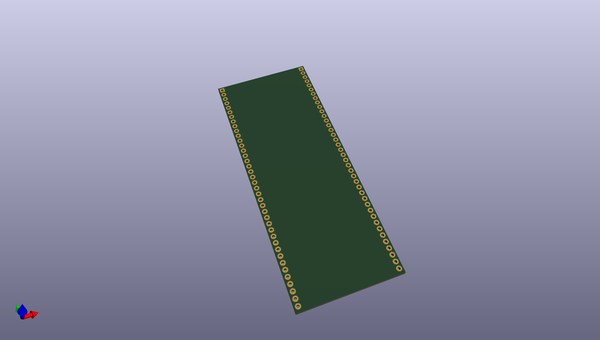
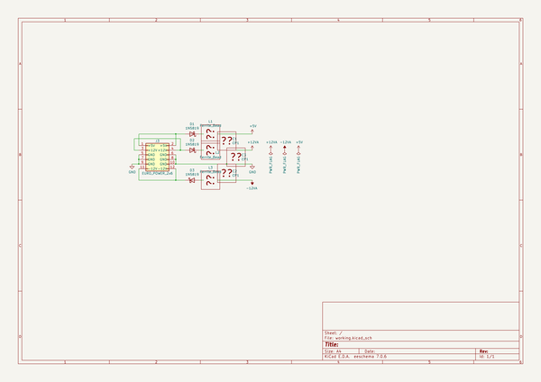

# OOMP Project  
## kxmx  by recursinging  
  
(snippet of original readme)  
  
- kxmx  
  
kxmx, pronounced "krachmacher", is a moniker connecting a heterogenous, but loosely coupled group of projects, mostly having to do with audio and music.  In sum, the components should form a sort of musical instrument, or maybe better a "rig", but I don't consider that a design goal.  
  
-- Motivation  
  
I'm in a band.  Actually, two.  I sing, not particularly good, but it's fun, and I enjoy making music.  What I enjoy more though, is learning about, and tinkering with the technical aspects of making music. Because of this, actual music composition or lyric writing can be regularly postponed for technical reasons.  
  
Easily bored, I like to keep a diverse set of projects going parallel.  These projects may lie dormant for months. I work, I have kids, I don't have much me time.  
  
-- Parts, moving or otherwise  
  
Here's a list of projects either already underway, or things I'd like to do eventually...  
  
--- kxmx_hirn  
  
A robust, portable (but damn heavy) [DJ case](https://www.magma-bags.de/multi-format-workstation-xl-plus.html) which I gutted and hacked to support Eurorack modules with 350 HU of capacity.  Built in are +19v, +12v, -12v, and +5v power supplies. A lot of the other kxmx components are in, or destined for this case, but since there are a number of ideas I'd like to explore with the case itself, making it a project in it's own right.  
  
--- kxmx_erack  
  
A set of basic PCB templates for Eurorack modules which leverage the wonder of exceptionally cheap chinese fabrication.  
  
  
  full source readme at [readme_src.md](readme_src.md)  
  
source repo at: [https://github.com/recursinging/kxmx](https://github.com/recursinging/kxmx)  
## Board  
  
  
## Schematic  
  
  
  
[schematic pdf](working_schematic.pdf)  
## Images  
