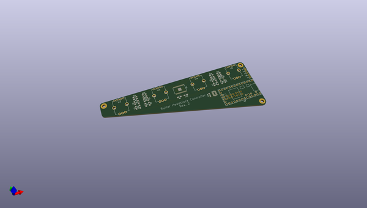
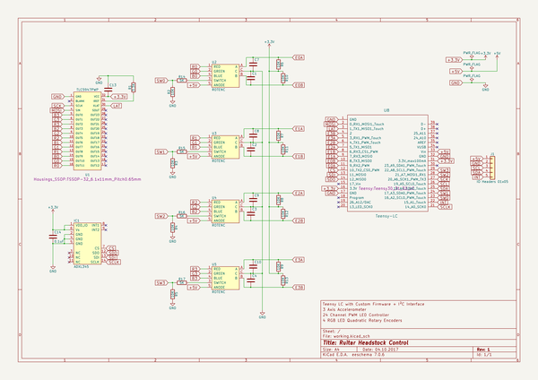

# OOMP Project  
## kxmx_ruitar  by recursinging  
  
(snippet of original readme)  
  
- kxmx_ruitar  
  
A guitar shaped MIDI/OSC instrument  
  
  
  
-- The Idea  
  
The goal of this project is pretty simple; Take the general functionality of your typical MIDI keyboard or control surface and implement it (robustly, and with low latency) in the form factor of a guitar.  The motivation is a a little less straightforward. Three things:  
  
1. I wanted to wear it on stage while maintaining the freedom to move about.    
1. I wanted to make it myself.  
1. It didn't want to spend a fortune.  
  
I like the form factor of a guitar because it can look quite traditional in a rock band context, but upon closer inspection is clearly not.  This reflects my taste in music, superficially recognizable, but substantially deviant.  While I can play the guitar, I didn't feel it necessary that a functional [guitar be augmented](http://lividinstruments.com/products/guitar-wing/) with MIDI controller capabilities, unless the two can be [seamlessly combined](https://www.rorguitars.com/products/expressiv-midi-pro). This is primarily because my single-threaded brain just cannot effectively handle playing an instrument well, while controlling other parameters.   
  
Because a guitar hangs down in front of you, facing out, visual controls and feedback are pretty useless.  [A touch screen on the front of the guitar](https://misa-digital.myshopify.com/products/tri-bass) for example, is effectively a touch-pad for the player and a light show f  
  full source readme at [readme_src.md](readme_src.md)  
  
source repo at: [https://github.com/recursinging/kxmx_ruitar](https://github.com/recursinging/kxmx_ruitar)  
## Board  
  
  
## Schematic  
  
  
  
[schematic pdf](working_schematic.pdf)  
## Images  
