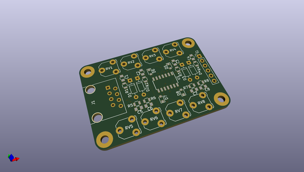
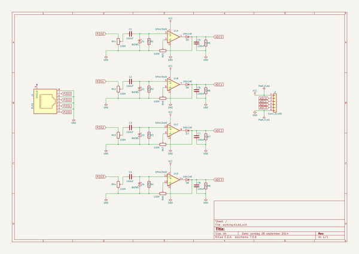

# OOMP Project  
## kxmx_trig  by recursinging  
  
oomp key: oomp_projects_flat_recursinging_kxmx_trig  
(snippet of original readme)  
  
- kxmx_trig  
  
A piezo drum trigger module, intended to collect and send a few drum events to kxmx_hirn where they can be abused.  
  
  full source readme at [readme_src.md](readme_src.md)  
  
source repo at: [https://github.com/recursinging/kxmx_trig](https://github.com/recursinging/kxmx_trig)  
## Board  
  
  
## Schematic  
  
  
  
[schematic pdf](working_schematic.pdf)  
## Images  
