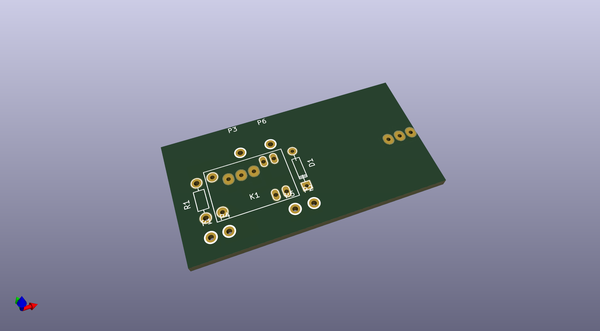
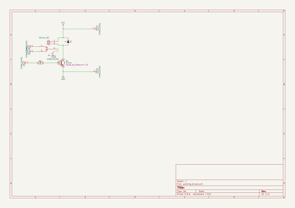

# OOMP Project  
## relay_module_songle_srs_05vdc_sl  by rigidus  
  
oomp key: oomp_projects_flat_rigidus_relay_module_songle_srs_05vdc_sl  
(snippet of original readme)  
  
- relay_module_songle_srs_05vdc_sl  
  
  full source readme at [readme_src.md](readme_src.md)  
  
source repo at: [https://github.com/rigidus/relay_module_songle_srs_05vdc_sl](https://github.com/rigidus/relay_module_songle_srs_05vdc_sl)  
## Board  
  
  
## Schematic  
  
  
  
[schematic pdf](working_schematic.pdf)  
## Images  
