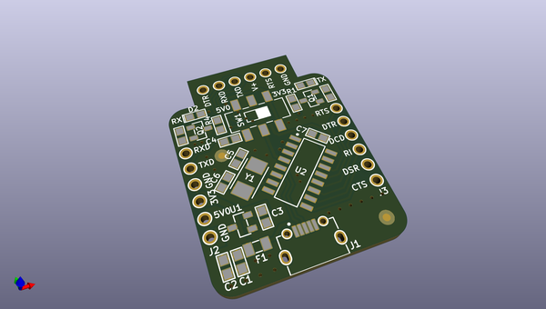
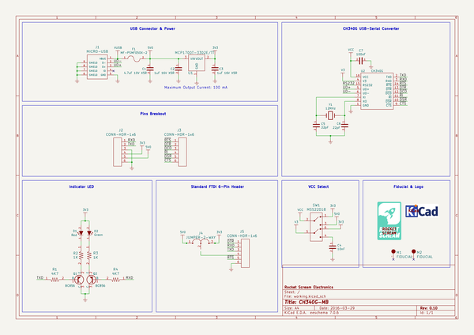

# OOMP Project  
## CH340G-MB  by rocketscream  
  
oomp key: oomp_projects_flat_rocketscream_ch340g_mb  
(snippet of original readme)  
  
- WCH CH340G USB-Serial Adapter Board  
WCH CH340G board is a cost effective USB-serial adapter with the ever familiar FTDI 6-pin female header which you can use with Arduino Pro or Pro Mini for both 3.3V and 5V version. The board supports both 5V and 3.3V IO voltage level through a slide switch. The board also has an on-board 3.3V LDO regulator to provide up to 250 mA of output current. The VCC pin on the 6-pin female header can be selectable to be either 5V or 3.3V. A green and red LED indicate TX & RX activity of the board. A resettable 0.5A fuse is included to provide protection to the USB port from over current. All other pins like RTS, DTR, DCD, RI, DSR, and CTS are made available for use on the side of the board.  
  
  full source readme at [readme_src.md](readme_src.md)  
  
source repo at: [https://github.com/rocketscream/CH340G-MB](https://github.com/rocketscream/CH340G-MB)  
## Board  
  
  
## Schematic  
  
  
  
[schematic pdf](working_schematic.pdf)  
## Images  
