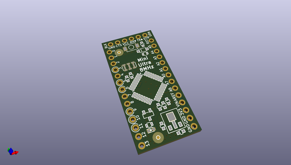

# OOMP Project  
## Mini-Ultra-8-MHz  by rocketscream  
  
(snippet of original readme)  
  
- Mini-Ultra-8-MHz  
A minimalistic ATMega328P based low Power Arduino compatible board. The board consumes only 1.7 uA of current during sleep mode. From version V1.60 onwards, we used KiCad to design the board. V1.50 was designed with Diptrace (still the best for commercial CAD package) and the design files are left in the repository as a reference.   
  
  full source readme at [readme_src.md](readme_src.md)  
  
source repo at: [https://github.com/rocketscream/Mini-Ultra-8-MHz](https://github.com/rocketscream/Mini-Ultra-8-MHz)  
## Board  
  
  
## Schematic  
  
  
  
[schematic pdf](working_schematic.pdf)  
## Images  
