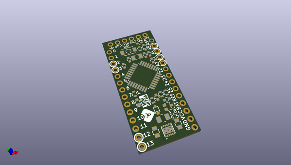

# OOMP Project  
## MiniUltra  by rocketscream  
  
oomp key: oomp_projects_flat_rocketscream_miniultra  
(snippet of original readme)  
  
- Mini Ultra  
  
An ultra low power Arduino compatible board based on the ATMega4808. The board is able to run from variety type of battery below and above it's 3.3V operating voltage. This allow batteries such as 2xNiMH, 3V CR123A, Li-Ion/Pol, 2 or 3 alkaline and LiFePO4 to be used. Board sleep at 3.7 uA with the on-chip real time counter (RTC) running.  
  
  full source readme at [readme_src.md](readme_src.md)  
  
source repo at: [https://github.com/rocketscream/MiniUltra](https://github.com/rocketscream/MiniUltra)  
## Board  
  
  
## Schematic  
  
  
  
[schematic pdf](working_schematic.pdf)  
## Images  
