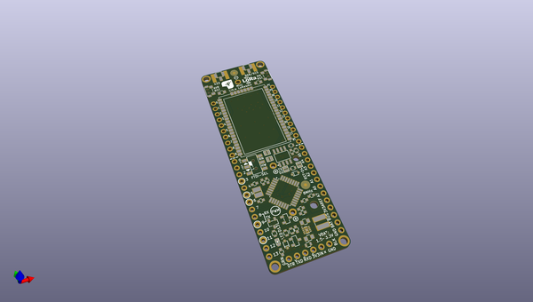

# OOMP Project  
## MiniUltraLoRaWAN  by rocketscream  
  
(snippet of original readme)  
  
- Mini Ultra LoRaWAN  
An Arduino compatible ultra low power single cell LoRaWAN node powered by ATMega328P and RN2483A/RN2903A LoRaWAN module. Able to run off single 1.5V batteries (AAA, AA, C & D) or 3.0V CR123A battery that could last over a year.  
  
  full source readme at [readme_src.md](readme_src.md)  
  
source repo at: [https://github.com/rocketscream/MiniUltraLoRaWAN](https://github.com/rocketscream/MiniUltraLoRaWAN)  
## Board  
  
  
## Schematic  
  
  
  
[schematic pdf](working_schematic.pdf)  
## Images  
