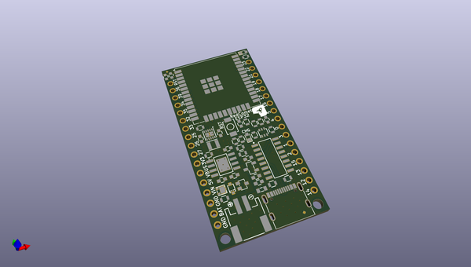

# OOMP Project  
## RedCometESP32  by rocketscream  
  
(snippet of original readme)  
  
- Red Comet ESP32  
  
An ultra low power ESP32 board. The board is able to run from variety type of battery below and above it's 3.3V operating voltage. This allow batteries such as 3xNiMH or 4xNiMH, Li-Ion/Pol, 3 or 4 alkaline and LiFePO4 to be used. Board sleep at 13.0 uA with charger off.  
  
  full source readme at [readme_src.md](readme_src.md)  
  
source repo at: [https://github.com/rocketscream/RedCometESP32](https://github.com/rocketscream/RedCometESP32)  
## Board  
  
  
## Schematic  
  
  
  
[schematic pdf](working_schematic.pdf)  
## Images  
