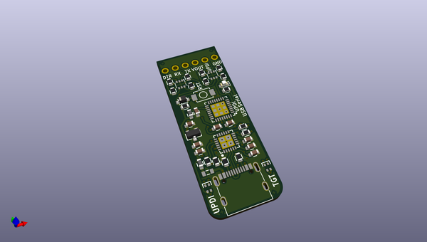
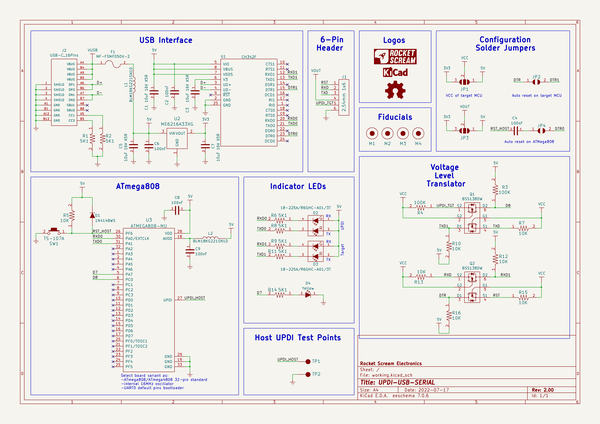

# OOMP Project  
## UPDI-USB-SERIAL  by rocketscream  
  
oomp key: oomp_projects_flat_rocketscream_updi_usb_serial  
(snippet of original readme)  
  
- UPDI-USB-SERIAL  
A dual USB port adapter with built-in UPDI programmer and a dedicated USB-serial interface board.  
  
  
  
  full source readme at [readme_src.md](readme_src.md)  
  
source repo at: [https://github.com/rocketscream/UPDI-USB-SERIAL](https://github.com/rocketscream/UPDI-USB-SERIAL)  
## Board  
  
  
## Schematic  
  
  
  
[schematic pdf](working_schematic.pdf)  
## Images  
