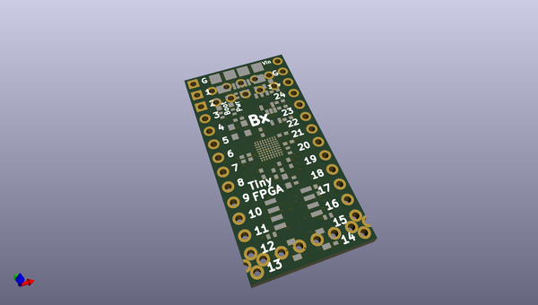
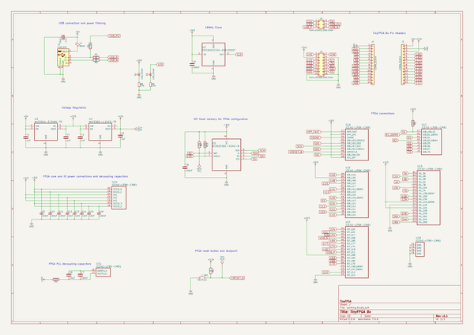

# OOMP Project  
## hardware  by rohbotics  
  
oomp key: oomp_projects_flat_rohbotics_hardware  
(snippet of original readme)  
  
- Hardware  
  
This repository contains the designs for any physical hardware -- most notably the custom adapter board that sits on the Romi platform connecting the Romi, Raspberry Pi, and TinyFPGA BX, and sensors together.  
  
-- pcb/tinyfpga-raspi-romi-board  
These are the KiCad design files for the PCB. It's designed as follows:  
  
* The Romi chassis needs to have the combined power distribution board and motor controller  
* The Romi PDB/MC's onboard regulator **NEEDS TO BE CONFIGURED TO 3.3V OUTPUT OR EVERYTHING WILL BREAK AND YOU WILL BE SAD**  
  * This is accomplished by cutting the "VREG Select" trace with an exacto knife.   
* Male headers need to be installed into the following locations (add a picture here....)  
  * PWMR / DIRR / nSLPR / GND  
  * PWML / DIRL / nSLPL / GND  
  * ERA / ERB / GND  
  * ELA / ELB / GND  
  * 3x VSW / 3x GND  
* The custom board should have female headers installed which mate with the male headers on the PDB/MC board  
* The raspberry pi and tinyfpga plug into the custom board  
  
-- build  
BOM files and stuff  
  
  full source readme at [readme_src.md](readme_src.md)  
  
source repo at: [https://github.com/rohbotics/hardware](https://github.com/rohbotics/hardware)  
## Board  
  
  
## Schematic  
  
  
  
[schematic pdf](working_schematic.pdf)  
## Images  
