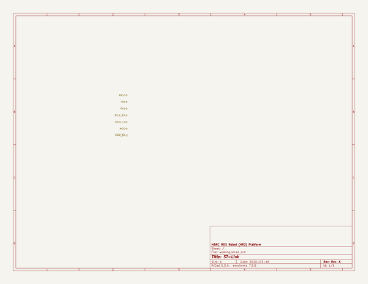

# OOMP Project  
## hbrc_ros_robot_platform  by rohbotics  
  
oomp key: oomp_projects_flat_rohbotics_hbrc_ros_robot_platform  
(snippet of original readme)  
  
- HBRC ROS Robot Platform  
  
The HBRC ROS Robot platform (ie. HR2 or just plain HR2) is a  
pedagogical robotic platform for teaching various robotics skills.  
  
  
  
This top level document is broken into the following sections below:  
  
* [Google Group](-google-group):  
  The Google Group mailing list for this project.  
  
* [Goals/Requirements](-goalsrequirements):  
  The goals and requirements for the project.  
  
* [Mechanical](-mechanical):  
  The mechanical engineering aspects of the project.  
  
* [Electrical](-electrical):  
  The electrical engineering aspects of the project.  
  
* [Software](-software):  
  The software engineering aspects of the project.  
  
* [Education](-education):  
  The education components of the pproject.  
  
* [Download/Installation](-downloadinstallation):  
  The download and installation portions of the project.  
  
-- Google Group  
  
There is a Google Groups mailing list to discuss this project at  
[HbrcRosRobotPlatform@GoogleGroups.Com](mailto:HbrcRosRobotPlatform@GoogleGroups.Com).  
To join the group, visit the  
[HBRC ROS Robot Platform web page](https://groups.google.com/d/forum/hbrcrosrobotplatform)  
(i.e. `https://groups.google.com/d/forum/hbrcrosrobotplatform`) and request to join.  
If that does not work, squirt a quick message to the group manager  
(`Wayne` AT_SIGN `Gramlich` PERIOD `Net`) requesting an invitation to join the group.  
  
Not all traffic on the group is going to be interesting to everybody else.  
To help   
  full source readme at [readme_src.md](readme_src.md)  
  
source repo at: [https://github.com/rohbotics/hbrc_ros_robot_platform](https://github.com/rohbotics/hbrc_ros_robot_platform)  
## Board  
  
  
## Schematic  
  
  
  
[schematic pdf](working_schematic.pdf)  
## Images  
