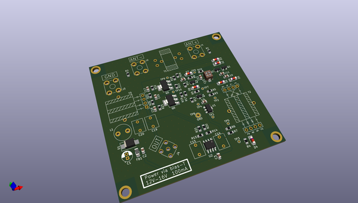
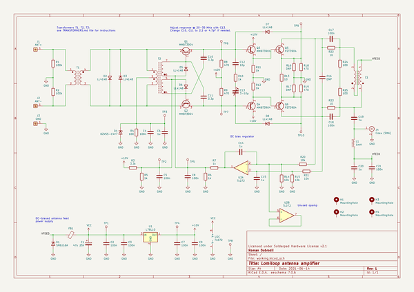

# OOMP Project  
## lomiloop  by romavis  
  
oomp key: oomp_projects_flat_romavis_lomiloop  
(snippet of original readme)  
  
- About  
  
**Lomiloop** is a wideband directional receiving loop antenna amplifier.  
  
With it, you can build antennas that look like [this](docs/ant1.jpg).  
  
It was designed for thick single-turn coreless loops with high area and low  
inductance, that are electrically small compared to the wavelength of received  
signal. With ~1.0m dia. loop, this allows to build an antenna that is  
moderately portable, wideband, displaying almost flat antenna factor throughout  
band of interest (approx. 50 kHz to 10 MHz), and has high enough sensitivity and  
discrimination of near-field E-field noise sources that it can be used for  
receiving LF and MF bands in urban areas. Usage of HF is possible, although not  
recommended due to:  
- Antenna noise which is noticeably higher than the atmospheric noise in HF band  
- Wave effects in the loop on frequencies above ~15 MHz.  
  
- Schematic and PCB  
  
All the files here were designed in KiCad 5.1.10.  
  
Schematic is also available in [PDF format](docs/schematic.pdf).  
  
The PCB that is presented in this repository was specifically designed for  
*Gainta G113* aluminium housing (also sold under Velleman brand in EU). For coax  
connection, it uses female SMA connector to which BNC-SMA pigtail is then  
connected, and Keystone 7771 screw terminals for loop connection. Actual loop is  
wired to the binding posts which are mounted on the housing and then wired to  
the Keystone terminals on the PCB.  
  
Photos of assembled PCB:  
  
<table>  
  <tr>  
    <td><a href="docs/ant3.jpg"><img src="  
  full source readme at [readme_src.md](readme_src.md)  
  
source repo at: [https://github.com/romavis/lomiloop](https://github.com/romavis/lomiloop)  
## Board  
  
  
## Schematic  
  
  
  
[schematic pdf](working_schematic.pdf)  
## Images  
