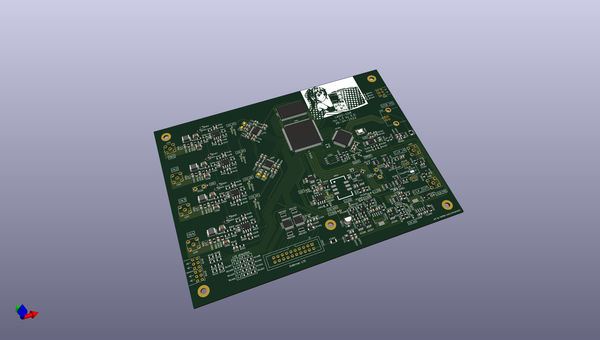
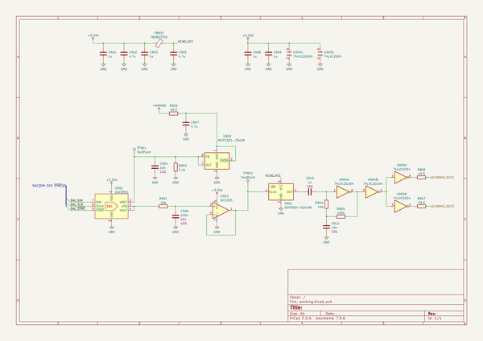

# OOMP Project  
## lwdo-sdr-hw  by romavis  
  
oomp key: oomp_projects_flat_romavis_lwdo_sdr_hw  
(snippet of original readme)  
  
- What  
  
**LWDO-SDR** is an experimental device for wide-band LF/VLF radio reception and using LF/VLF signals for precise timekeeping and generic DSP/SDR research purposes.  
  
The name LWDO-SDR *(**l**ong-**w**ave **d**isciplined **o**scillator with **s**oftware **d**efined **r**adio)* is a moniker aking to a widely-used *GPSDO* term, but instead of GPS we use signals transmitted within long wave radio band, and SDR for signal processing.  
  
- Goals  
  
LWDO-SDR is built upon following ideas:  
- Wide dynamic range capture of the whole LF/VLF radio spectrum (up to 500 KHz)  
  - Simultaneous reception of any number of stations  
  - Exposing it as a WebSDR (for the fun of it?)  
- Precise built-in VCTCXO oscillator  
  - Generates tightly controlled ADC sample clock that allows for SDR processing using large-time-constant averaging  
  - Digitally-controlled (via 16 bit DAC), and can be disciplined by:  
    - External 1 PPS or 1,2,5,10MHz reference (via DPLL)  
    - Received radio signals  
- Synchronous capture from multiple antennas (up to 4)  
  - Experiments with urban noise suppression SDR algorithms   
  - Directional reception (using e.g. two or three loop antennas)  
- Raw data streaming over USB High Speed interface, processing on the USB host device (PC, RaspberryPi, etc.)  
  - Because we don't want to be limited by computing power of an embedded MCU or DSP  
- Single PCB, two form-factors:  
  - Standalone, USB bus-powered - for ease of use and portability (uses Hammond 1455P1601 case)  
  - Embedded,  
  full source readme at [readme_src.md](readme_src.md)  
  
source repo at: [https://github.com/romavis/lwdo-sdr-hw](https://github.com/romavis/lwdo-sdr-hw)  
## Board  
  
  
## Schematic  
  
  
  
[schematic pdf](working_schematic.pdf)  
## Images  
  
  
  
  
  
  
  
  
  
  
  
  
  
  
  
  
