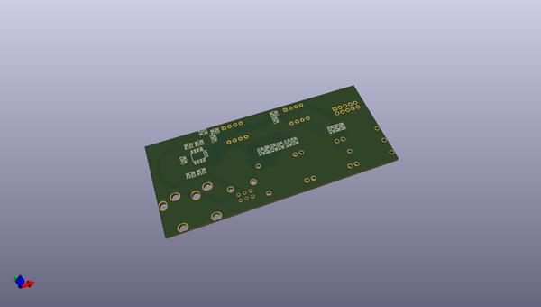
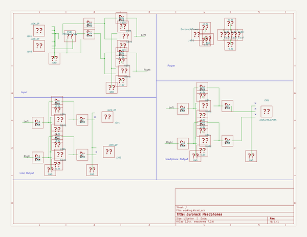

# OOMP Project  
## eurorack_headphones  by russellmcc  
  
(snippet of original readme)  
  
This is a tested design for a small headphone amp/line output module for eurorack modular synthesizers.  
  
Most of the construction is SMT, with the exception of user-replaceable socketted op-amps.  
  
Please use the BOM.txt to order parts.  
  
This is 5hp and uses 20mA current.  
  
This work is licensed under a [Creative Commons Attribution-ShareAlike 3.0 Unported License.](http://creativecommons.org/licenses/by-sa/3.0/deed.en_US)  
  
  full source readme at [readme_src.md](readme_src.md)  
  
source repo at: [https://github.com/russellmcc/eurorack_headphones](https://github.com/russellmcc/eurorack_headphones)  
## Board  
  
  
## Schematic  
  
  
  
[schematic pdf](working_schematic.pdf)  
## Images  
