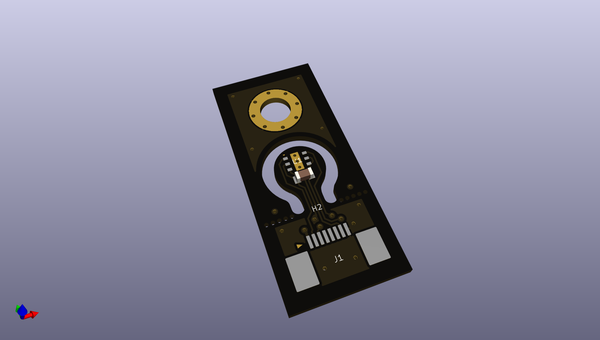
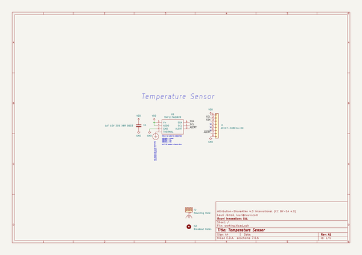

# OOMP Project  
## connector  by ruuvi  
  
(snippet of original readme)  
  
- Ruuvi Connector system  
  
Ruuvi Connector is a standardised expansion connector and cable system that takes sensor prototyping to the next level. Compatible connectors will be found on many upcoming Ruuvi products.  
  
  
  
There are many ways on how to use the Ruuvi Connector system:  
  
1) Connect compatible external boards and sensors to your Ruuvi products  
2) Design your own Ruuvi Connector expansion boards  
3) Feed your battery powered Ruuvi products from external power sources  
4) Add a Ruuvi Connector compatible connector on your own product and make it compatible with all the external Ruuvi / Grove / Qwiic / STEMMA / Gravity sensors  
5) Innovate and create something totally new  
  
Ruuvi Connector is compatible with 4-pin (2 signals + VDD + GND) prototyping systems such as [Seeed Studio Grove](http://wiki.seeedstudio.com/Grove_System/), [Sparkfun Qwiic](https://www.sparkfun.com/qwiic), [Adafruit STEMMA](https://learn.adafruit.com/introducing-adafruit-stemma-qt/), [DFRobot Gravity](https://www.dfrobot.com/gravity) and more.  
  
  
  
-- Ruuvi Connector pin-out  
  
Ruuvi Connector cables have 8 pins (6 signals + VDD + GND). This allows using not just simple I2C sensors but also more powerful SPI sensors equipped with interrupt signals.  
  
Note that on RuuviTags that have Ruuvi Connectors available, pins 2 and 3 are shared with internal I2C sensors. Also pin 7 is connected to TMP117 temperature sensor's interrupt si  
  full source readme at [readme_src.md](readme_src.md)  
  
source repo at: [https://github.com/ruuvi/connector](https://github.com/ruuvi/connector)  
## Board  
  
  
## Schematic  
  
  
  
[schematic pdf](working_schematic.pdf)  
## Images  
