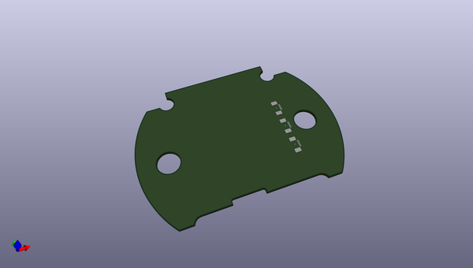
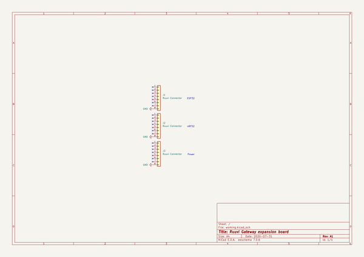

# OOMP Project  
## gateway-expansion  by ruuvi  
  
oomp key: oomp_projects_flat_ruuvi_gateway_expansion  
(snippet of original readme)  
  
- gateway-expansion  
This is a template project that helps with creating new Ruuvi Gateway expansion boards  
  
  full source readme at [readme_src.md](readme_src.md)  
  
source repo at: [https://github.com/ruuvi/gateway-expansion](https://github.com/ruuvi/gateway-expansion)  
## Board  
  
  
## Schematic  
  
  
  
[schematic pdf](working_schematic.pdf)  
## Images  
