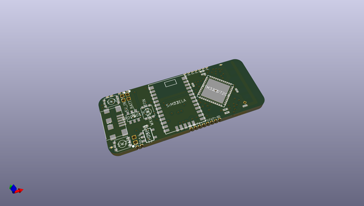

# OOMP Project  
## ruuvilogger_hw  by ruuvi  
  
oomp key: oomp_projects_flat_ruuvi_ruuvilogger_hw  
(snippet of original readme)  
  
- RuuviLogger: Open-Source GPS logging device  
  
You can find RuuviLogger related hardware design files from this repository. Design is almost finished, but not 100% ready. If RuuviLogger project continues, Rev.A version will be probably deprecated.  
  
All the design files are licensed under Attribution-ShareAlike 4.0 International (CC BY-SA 4.0). Copyright: Lauri Jämsä, Ruuvi Innovations Ltd.  
  
More info (a few blog posts) about the project: http://ruuvi.com/blog  
  
  full source readme at [readme_src.md](readme_src.md)  
  
source repo at: [https://github.com/ruuvi/ruuvilogger_hw](https://github.com/ruuvi/ruuvilogger_hw)  
## Board  
  
  
## Schematic  
  
  
  
[schematic pdf](working_schematic.pdf)  
## Images  
