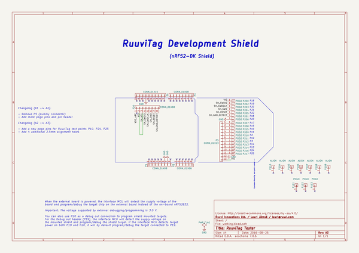

# OOMP Project  
## ruuvitag-devshield  by ruuvi  
  
oomp key: oomp_projects_flat_ruuvi_ruuvitag_devshield  
(snippet of original readme)  
  
- RuuviTag DevShield  
  full source readme at [readme_src.md](readme_src.md)  
  
source repo at: [https://github.com/ruuvi/ruuvitag-devshield](https://github.com/ruuvi/ruuvitag-devshield)  
## Board  
  
  
## Schematic  
  
  
  
[schematic pdf](working_schematic.pdf)  
## Images  
