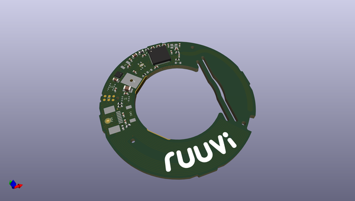
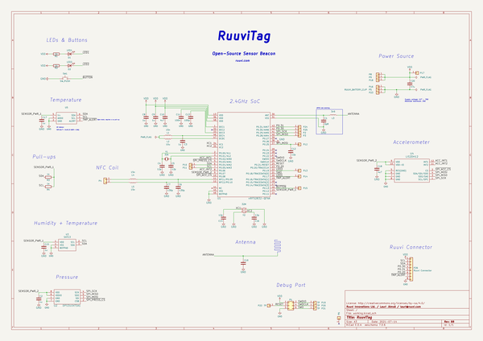

# OOMP Project  
## ruuvitag_hw  by ruuvi  
  
oomp key: oomp_projects_flat_ruuvi_ruuvitag_hw  
(snippet of original readme)  
  
- RuuviTag: Open-Source Sensor Platform  
  
* Rev.A1 - the first RuuviTag ever invented.  
* Rev.A2 - minor modifications. Note: neither A1 or A2 are currently mass produced by Ruuvi.  
* Rev.B1 - a completely new design. Larger footprint, nRF52 radio chip etc.  
* Rev.B2 - an enhanced version of the B1.  
* Rev.B3 - an enhanced version of the B2.  
* Rev.B4 - an enhanced version of the B3.  
* Rev.B5 - an enhanced version of the B4.  
* Rev.B6 - an enhanced version of the B5.  
* Rev.B7.1 - an enhanced version of the B6.  
* Rev.B8 - an enhanced version of the B7.1.  
  
All the design files are licensed using Attribution-ShareAlike 4.0 International (CC BY-SA 4.0).  
Copyright: Lauri Jämsä, Ruuvi Innovations Ltd. Neither the name of the RuuviTag nor the names of its contributors may be used to endorse or promote products derived from this project without specific prior written permission. While unofficial products should not have "Ruuvi" in their name, it's okay to describe your product in relation to the Ruuvi projects. More info: license@ruuvi.com.  
  full source readme at [readme_src.md](readme_src.md)  
  
source repo at: [https://github.com/ruuvi/ruuvitag_hw](https://github.com/ruuvi/ruuvitag_hw)  
## Board  
  
  
## Schematic  
  
  
  
[schematic pdf](working_schematic.pdf)  
## Images  
