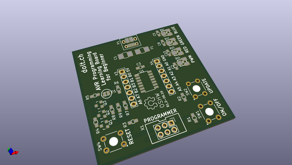

# OOMP Project  
## AVR-Intro  by samdolt  
  
oomp key: oomp_projects_flat_samdolt_avr_intro  
(snippet of original readme)  
  
- AVR-Intro  
  
-- Contenu / Inhalt  
  
- Installing the toolchain  
- AVR Programming with GCC tools ( Command line )  
- Register and GPIO  
- Assembler and delay  
- AVR-Libc helper function  
- ADC  
- Interrupt  
- Timer  
- PWM  
  
  full source readme at [readme_src.md](readme_src.md)  
  
source repo at: [https://github.com/samdolt/AVR-Intro](https://github.com/samdolt/AVR-Intro)  
## Board  
  
  
## Schematic  
  
  
  
[schematic pdf](working_schematic.pdf)  
## Images  
