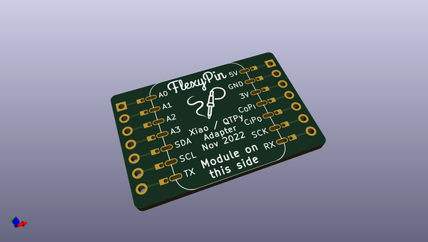
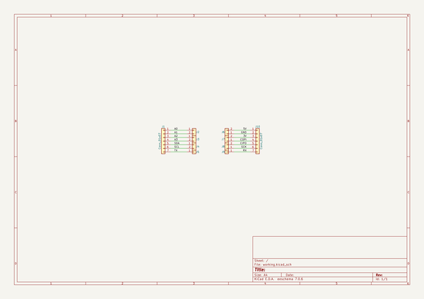
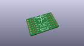
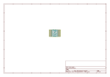
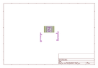
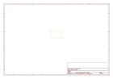
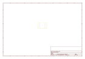
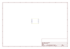
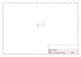

# OOMP Project  
## flexypin_adapters_hw  by solderparty  
  
oomp key: oomp_projects_flat_solderparty_flexypin_adapters_hw  
(snippet of original readme)  
  
- FlexyPin Adapters  
  
  
  
To learn more about FlexyPins, see the dedicated repo here: https://github.com/solderparty/flexypin  
  
This repo contains a collection of open hardware designs for common modules that can be used with FlexyPins.  
  
-- ESP32-C3-WROOM  
  
  
-- ESP32-S2-SOLO / ESP32-S3-WROOM  
  
  
-- ESP32-WROOM  
  
  
-- M5Stamp-Pico  
  
  
-- RFM9x  
  
  
-- RaspberryPi Pico  
  
  
-- ESP-12  
  
  
-- WIO RP2040  
  
  
-- ESP32-WROVER  
  
  
-- RaspberryPi Pico to Uno  
  
  
-- Xiao / QTPy  
  
  full source readme at [readme_src.md](readme_src.md)  
  
source repo at: [https://github.com/solderparty/flexypin_adapters_hw](https://github.com/solderparty/flexypin_adapters_hw)  
## Board  
  
  
## Schematic  
  
  
  
[schematic pdf](working_schematic.pdf)  
## Images  
  
  
  
  
  
  
  
  
  
  
  
  
  
  
  
  
