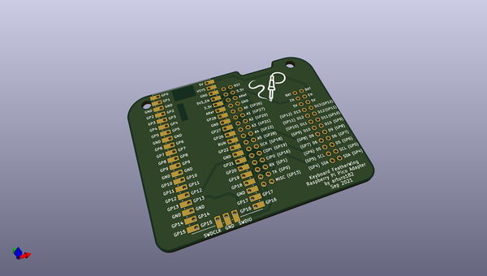
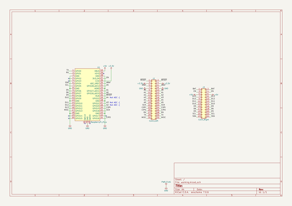

# OOMP Project  
## keyboard_featherwing_pico_adapter  by solderparty  
  
(snippet of original readme)  
  
- Raspberry Pi Pico Adapter for the Keyboard FeatherWing  
  
  
  
This adapter was designed specifically to allow driving the Keyboard FeatherWing with a Raspberry Pi Pico board.  
  
Note: Because the Pico only has 3 analog pins, only A0, A1, and A5 of the Keyboard FeatherWing can actually be used to read analog values.  
  
- Links  
  
For more information visit https://kfw.solder.party/rev2/  
  
  full source readme at [readme_src.md](readme_src.md)  
  
source repo at: [https://github.com/solderparty/keyboard_featherwing_pico_adapter](https://github.com/solderparty/keyboard_featherwing_pico_adapter)  
## Board  
  
  
## Schematic  
  
  
  
[schematic pdf](working_schematic.pdf)  
## Images  
